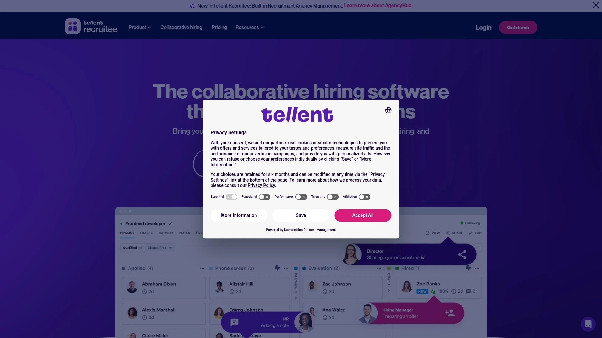

# 2025年排名前18的招聘管理软件盘点(最新整理)

在当今竞争激烈的人才市场中,企业面临着简历筛选效率低、候选人跟进困难、团队协作不畅等核心痛点。一款合适的申请人追踪系统(ATS)能够自动化职位发布、简历解析、面试安排等繁琐流程,帮助HR团队将时间投入到更具战略价值的人才评估与雇主品牌建设中。本文精选18款经过市场验证的招聘管理平台,覆盖从初创企业到大型集团的多元化需求,助您快速找到提升招聘效率、降低用人成本、优化候选人体验的最佳解决方案。

## **[Breezy HR](https://breezy.hr)**

简化中小企业招聘流程的高性价比首选平台

Breezy HR以其直观的拖拽式招聘管道和强大的自动化功能脱颖而出,特别适合预算有限但追求效率的成长型团队。平台提供免费基础版本,支持单个职位发布与无限用户协作,这在ATS市场中极为罕见。

核心功能包括AI驱动的候选人匹配评分系统,可自动优先排序最符合职位要求的应聘者,大幅减少人工筛选时间。内置的团队协作工具允许招聘经理实时留下评价、评分和反馈,所有信息集中在候选人档案中,决策过程高度透明。

**自动化能力**方面,Breezy支持一键将职位同步发布到LinkedIn、Indeed等多个招聘渠道,并自动汇总所有平台的应聘简历。邮件、短信和面试安排均可设置触发规则,系统会根据候选人所处阶段自动发送个性化沟通内容。

付费计划从每月157美元起,包含视频面试筛选、推荐人背景调查、可定制招聘工作流等高级功能。Enterprise版本还提供员工推荐门户、第三方猎头接口、多层级审批流程等企业级特性。移动端应用支持随时随地处理候选人申请,确保招聘进度不受地点限制。

对于刚开始搭建招聘体系的小型企业,Breezy的免费版已能满足基本需求;当团队规模扩大或招聘复杂度提升时,可无缝升级到付费方案获取更多自动化和定制化能力。

## **[JazzHR](https://www.jazzhr.com)**

专注中小企业的数据驱动型招聘解决方案

JazzHR以其强大的搜索过滤工具和清晰的分析报表在中小企业市场占据重要地位。平台设计理念围绕效率与数据透明度展开,帮助招聘团队通过量化指标持续优化招聘策略。

系统提供分层架构,基础功能涵盖职位发布、简历管理、候选人评分等标准ATS能力。高级搜索功能支持按技能、地理位置、工作经验等多维度快速定位目标候选人,显著缩短职位填补周期。

**定价结构**具有显著灵活性,起步价格适合预算紧张的小型企业,随着招聘量增长可选择更高级别方案。平台集成常用的背景调查、技能测评等第三方服务,构建完整的候选人评估生态。

报表模块提供招聘漏斗转化率、来源渠道效果、平均招聘周期等关键指标的可视化呈现,管理层可据此调整招聘预算分配和渠道投放策略。移动优化界面确保招聘经理在通勤或出差途中也能快速响应优质候选人。

## **[Recruitee](https://recruitee.com)**

强调团队协作的现代化招聘平台

Recruitee专为内部招聘团队打造,其核心竞争力在于让多角色成员在同一平台无缝配合完成招聘任务。界面简洁友好,新用户通常只需极短时间即可掌握核心操作流程。

平台支持自定义招聘阶段,不同职位类型可配置不同的审批流程和评估标准。团队成员可实时查看候选人进展、添加评论、@同事讨论,确保信息透明且决策高效。

**候选人体验**优化是Recruitee的另一亮点,移动端友好的申请流程降低优质人才的流失率。自动化沟通模板确保每位应聘者在各个阶段都能收到及时反馈,提升雇主品牌形象。

集成能力覆盖主流HRIS系统,候选人转为正式员工后,数据可一键同步至人力资源管理平台,避免重复录入。定价透明合理,按用户数收费模式适合团队规模相对稳定的企业。

## **[Workable](https://www.workable.com)**

全球化企业的全功能招聘管理系统

Workable服务于对招聘体系有较高要求的中大型企业,提供从职位发布到入职管理的端到端解决方案。平台在全球范围内拥有广泛用户基础,支持多语言、多币种、多时区运营。

**AI筛选引擎**能够自动解析简历并提取关键信息,与职位描述进行智能匹配,为招聘人员推荐最相关的候选人。内置的候选人关系管理(CRM)功能支持长期维护人才库,定期通过邮件活动触达潜在候选人。

平台整合超过200个招聘渠道,包括通用招聘网站、垂直行业平台和社交媒体,一次发布即可覆盖多元化人才来源。视频面试、技能测评、背景调查等关键环节均有原生集成或深度对接方案。

高级分析仪表板提供招聘成本、时间效率、渠道ROI等管理洞察,支持导出定制化报表供高层决策使用。月费起价189美元,适合年招聘量在50人以上的组织。

## **[BambooHR](https://www.bamboohr.com)**

HRIS与招聘一体化的综合型人力资源平台

BambooHR并非纯粹的ATS,而是将招聘模块无缝嵌入完整HRIS系统的综合性解决方案。这种设计特别适合希望统一管理招聘、入职、薪酬、绩效等全生命周期HR流程的企业。

招聘功能涵盖职位发布、候选人追踪、面试安排等标准环节,数据自动流转至员工档案系统,新员工从Offer签署到首日入职的所有信息无需二次录入。这种一体化架构显著减少系统切换和数据迁移成本。

**用户界面**设计注重易用性,即使非技术背景的HR人员也能快速配置招聘流程。移动应用支持经理在任何设备上审批职位申请、查看候选人资料、完成面试评价。

对于已经使用或计划引入全面HRIS的企业,BambooHR提供了降低技术栈复杂度的理想选择。平台通过持续产品创新保持竞争力,集成生态系统包含薪资、福利、时间管理等众多第三方应用。

## **[Manatal](https://www.manatal.com)**

AI赋能的招聘软件与CRM双引擎系统

Manatal将申请人追踪与候选人关系管理深度整合,特别适合猎头公司和高频招聘的企业HR团队。平台以AI技术为核心,从简历解析到候选人推荐全流程实现智能化。

**定价极具竞争力**,入门级方案仅需每用户每月15美元,即可获得最多15个活跃职位、免费发布到30+招聘渠道、无限简历解析等功能。这一价格水平显著低于行业平均,使预算敏感型企业也能享受现代化招聘工具。

AI候选人推荐引擎通过机器学习分析历史招聘数据,主动向招聘人员推送人才库中最匹配的潜在候选人。Sourcing Hub功能整合多个人才搜索渠道,支持一站式挖掘被动求职者。

自定义简历构建器、每周账户摘要报告、快速筛选工具等细节功能体现了平台对用户体验的重视。高级计划支持无限职位发布,适合大规模招聘场景。

## **[Greenhouse](https://www.greenhouse.io)**

结构化招聘方法论的企业级标杆平台

Greenhouse在中大型企业市场享有盛誉,其产品设计基于严谨的结构化招聘理念,帮助组织建立可重复、可衡量的人才获取体系。平台特别适合科技公司、快速成长型企业等对招聘质量有极高要求的组织。

**数据分析能力**是Greenhouse的核心优势,系统提供40+预置报表,覆盖招聘漏斗各阶段的关键指标,支持按部门、职位、招聘经理等维度交叉分析。管理层可据此识别流程瓶颈、优化面试官配置、预测招聘周期。

平台强调面试标准化,面试指南功能确保所有面试官针对相同能力维度提问评估,减少主观偏见对决策的影响。候选人评分体系支持多维度量化比较,使最终Offer发放基于客观数据而非直觉判断。

集成生态系统极为丰富,涵盖背景调查、技能测评、视频面试、员工推荐等招聘全链条工具。定价采用定制报价模式,通常适合年招聘规模在100人以上的企业。

## **[Lever](https://www.lever.co)**

人才关系管理与ATS深度融合的全周期平台

Lever的独特之处在于将候选人关系管理(CRM)原生集成到申请人追踪系统中,支持从被动人才挖掘到主动申请处理的完整流程。这种设计特别适合需要持续建立人才储备池的企业。

**人才培育功能**允许招聘团队对人才库中的候选人进行细分标签管理,通过自动化邮件活动定期触达,将潜在人才逐步转化为活跃申请者。AI驱动的候选人再发现功能会主动提醒招聘人员,当前职位可能适合哪些历史库中的候选人。

平台提供300+原生集成,无需依赖Zapier等第三方工具即可与主流HR技术栈无缝对接。交互式分析仪表板支持实时监控招聘进度,预测性分析功能帮助团队提前识别潜在延迟风险。

审批工作流支持多层级配置,财务、HR、部门负责人可按预设规则参与职位审批、Offer审批等关键决策节点,确保招聘活动与业务目标对齐。适合从高成长初创到全球企业的多种规模组织。

## **[Zoho Recruit](https://www.zoho.com/recruit)**

灵活适配猎头与企业HR的双模式招聘系统

Zoho Recruit独特地服务于两类截然不同的用户群体:第三方猎头机构和企业内部HR部门,通过模块化设计满足各自需求。平台提供免费版涵盖基础ATS功能,付费版则解锁高级自动化和AI能力。

**简历解析引擎**自动提取候选人信息并智能匹配职位需求,AI评分系统帮助招聘人员快速识别高潜力申请者。猎头模式下,系统支持客户门户、候选人门户等多方协作界面,便于管理复杂的三方关系。

企业HR模式侧重内部流程优化,包括多部门协同、审批工作流、员工推荐计划等功能。与Zoho生态系统其他产品(CRM、邮件营销、分析工具等)深度集成,构建统一的业务操作平台。

定价分层清晰,从免费版到高级企业版覆盖不同预算区间。自动化工作流引擎支持无代码配置复杂招聘流程,技术门槛较低。

## **[SmartRecruiters](https://www.smartrecruiters.com)**

企业级招聘营销与协同平台

SmartRecruiters围绕其SmartOS平台构建,将招聘营销、申请人追踪、协同工作流整合为统一体验。平台特别强调候选人体验和雇主品牌建设,适合重视雇主形象的大中型企业。

**Winston Intelligence** AI模块包含四大智能组件,覆盖候选人匹配、简历筛选、沟通优化等核心环节。SmartAnalytics分析套件提供深度招聘数据洞察,支持按业务单元、地理区域等维度生成定制报表。

集成市场SmartMarketplace汇聚数百款第三方应用,从背景调查到薪资基准,扩展平台核心功能。但需注意,部分高级功能依赖集成实现而非原生提供。

SmartCRM模块支持建立长期人才关系,通过细分标签和自动化营销活动持续培育候选人。起步价14,995美元,定位企业级市场。

## **[iCIMS](https://www.icims.com)**

大型企业的端到端人才获取套件

iCIMS是全球最大的招聘软件供应商之一,服务于超过4,000家企业客户,特别擅长支持复杂组织架构和大规模招聘场景。平台覆盖从雇主品牌、候选人体验到入职管理的完整人才获取生命周期。

**合规性与安全性**是iCIMS的核心优势,系统符合全球主要地区的数据保护法规,支持多国劳动法规则配置。这对跨国企业尤为关键。

平台与Microsoft、UKG、Infor等主流HCM供应商建立战略合作,确保数据在招聘与人力资源系统间无缝流转。市场生态包含背景调查、测评、入职等众多专业服务提供商。

高度可配置的工作流引擎支持企业根据自身流程定制招聘管道,而非被迫适应软件固定逻辑。定价采用定制方案,通常适合员工规模千人以上的大型组织。

## **[Pinpoint](https://www.pinpointhq.com)**

注重用户体验的优质招聘软件

Pinpoint以其直观易用的界面和流畅的操作体验在ATS市场中脱颖而出,G2评分在易用性维度达到9.1分。平台特别适合希望快速部署、减少培训成本的中型企业。

系统设计注重减少招聘人员的重复操作,智能化建议功能会根据上下文主动推荐下一步行动。候选人界面同样经过精心打磨,移动端申请流程简洁高效,有效降低申请放弃率。

**协作功能**支持团队成员实时共享候选人反馈、同步面试日程、协同决策,避免信息孤岛。集成能力覆盖主流招聘渠道和HR工具,构建高效的招聘技术栈。

服务支持响应迅速,用户反馈问题通常能在短时间内得到解决。提供服务合作计划,欢迎HR顾问等专业机构加入生态。

## **[Ashby](https://www.ashbyhq.com)**

为高成长科技公司打造的现代化ATS

Ashby定位高成长初创企业和科技公司,以其强大的分析能力和灵活的工作流配置著称。平台设计理念是让招聘流程既高效又具备深度数据洞察。

**工作流灵活性**允许企业根据不同职位类型配置完全不同的招聘阶段、审批规则和评估标准,而不受系统预设模板限制。报表系统支持交互式数据探索,招聘领导者可自定义指标、拖拽维度进行多角度分析。

合作伙伴生态包含兼职招聘人员、咨询公司、运营专家等多类型服务商,为用户提供从战略规划到具体实施的全方位支持。平台通过开放API鼓励技术集成开发。

虽然目前主要服务中小团队,但产品架构设计支持向更大规模扩展。专家认证计划培养熟悉Ashby最佳实践的顾问群体,帮助企业快速实现价值。

## **[Jobvite](https://www.jobvite.com)**

复杂招聘需求的全功能解决方案

Jobvite专为应对复杂招聘场景设计,特别适合高频招聘、细分职位多样、候选人量级大的企业。平台将ATS、CRM、招聘营销、入职管理整合为统一系统。

**60+预置报表**配合拖拽式自定义仪表板,让招聘数据可视化变得简单直观。Pillar AI面试助手提供标准化面试指导,记录面试要点,确保企业级招聘的一致性。

原生CRM功能支持构建细分人才池,通过个性化培育活动将被动候选人逐步转化为积极申请者。自动化能力贯穿从简历筛选到入职提醒的全流程,显著减少人工重复劳动。

高级员工推荐、入职管理等模块化附加功能允许企业按需购买,避免为不需要的功能买单。适合中大型企业和快速扩张的成长型公司。

## **[Freshteam](https://www.freshteam.com)**

Freshworks生态下的轻量级HR解决方案

Freshteam是Freshworks产品家族成员,为中小企业提供招聘与人力资源管理的入门级解决方案。如果企业已在使用Freshdesk、Freshsales等Freshworks产品,Freshteam能实现数据互通和统一管理界面。

平台涵盖职位发布、候选人追踪、入职管理、员工数据库等核心HR功能。社交媒体招聘功能支持直接从LinkedIn、Facebook等平台吸引候选人。

**自动化工作流**减少手动操作,例如简历收到后自动发送确认邮件、面试结束后自动收集面试官反馈等。界面清爽简洁,学习曲线平缓。

定价透明且经济实惠,适合预算有限但希望实现招聘数字化的小型企业。随着企业成长,可升级到更高级别方案解锁更多功能。

## **[ApplicantStack](https://www.applicantstack.com)**

美国本土企业的直观招聘与入职平台

ApplicantStack专注服务美国市场的中小企业,提供招聘、候选人管理、入职自动化的一体化解决方案。平台设计强调简单易用,帮助非技术背景的HR人员快速上手。

**可定制工作流**支持根据企业实际流程配置招聘阶段,候选人在各阶段间流转时自动触发相应操作。协同工具允许招聘团队对候选人进行评论、评分和讨论,决策过程留痕可追溯。

入职模块自动化新员工文书工作、任务分配、培训流程,确保新人从第一天起就获得积极体验。与主流招聘渠道、背景调查服务深度集成,构建完整招聘生态。

提供推荐计划,现有客户向其他企业推荐可获得奖励。技术支持响应及时,帮助中心提供详细操作指南和常见问题解答。

## **[RecruitCRM](https://recruitcrm.io)**

猎头与人力资源公司的专业级ATS+CRM系统

RecruitCRM专为猎头公司、RPO机构和内部招聘团队设计,深度整合申请人追踪与客户关系管理功能。平台特别理解招聘服务行业的复杂需求,支持管理多客户、多候选人、多职位的三维关系网络。

**端到端流程管理**涵盖客户开发、职位录入、候选人搜寻、面试安排、Offer谈判到佣金结算的完整业务链条。自动化引擎能够根据客户偏好智能匹配候选人,提高推荐成功率。

邮件集成、通话记录、活动跟踪等销售功能帮助猎头顾问高效管理客户关系。数据分析模块提供业绩指标、转化率、收入预测等关键商业洞察。

移动应用支持顾问在拜访客户或参加活动时随时查询候选人资料、更新职位状态。适合从单人顾问到大型猎头公司的多种规模组织。

## **[CVViZ](https://cvviz.com)**

AI简历筛选的专业招聘平台

CVViZ以其强大的AI简历解析和候选人匹配能力在市场中占据一席之地。平台特别适合简历量大、筛选耗时的高频招聘场景。

人工智能引擎能够自动提取简历中的技能、经验、教育背景等结构化信息,并与职位要求进行语义级匹配,推荐最相关的候选人。这一功能显著减少招聘人员手动浏览简历的时间投入。

**简历解析额度**采用积分制,不同定价计划包含不同数量的年度解析积分。起步价99美元/月支持最多5个活跃职位和无限用户,适合小团队或招聘频率不高的企业。

系统支持多种简历格式上传,包括PDF、Word、图片等,自动识别并转换为标准化数据。提供标准ATS功能如职位发布、候选人管道管理、团队协作等。

## **[Loxo](https://loxo.co)**

人才情报驱动的招聘平台

Loxo将人才搜索、ATS、CRM三大功能深度融合,特别擅长帮助招聘团队发现和吸引被动候选人。平台内置强大的人才数据库和搜索引擎,覆盖全球数亿职场人士信息。

**智能搜索功能**支持按技能、公司、职位、地理位置等多维度组合查询,快速定位目标人才。系统自动聚合候选人在多个平台的公开信息,形成完整的职业画像。

CRM模块帮助招聘人员长期维护人才关系,通过序列化邮件活动、提醒任务等方式持续培育潜在候选人。与LinkedIn、邮箱等日常工作工具深度集成,减少平台切换。

平台还提供定制培训、市场推广支持等增值服务,帮助合作伙伴提升招聘能力和品牌影响力。适合需要主动挖掘稀缺人才的企业和猎头机构。

***

## 常见问题

**如何评估一款招聘软件是否适合自己的企业?**

首先明确年招聘量、团队规模、预算范围等基础参数,然后重点考察系统是否支持当前招聘流程的关键环节。建议申请免费试用,让实际使用者(招聘人员、部门经理)参与评估易用性和功能匹配度。关注系统与现有HR技术栈(HRIS、薪资系统等)的集成能力,避免形成数据孤岛。

**中小企业选择免费版招聘软件能否满足需求?**

Breezy HR、Zoho Recruit等平台的免费版已覆盖职位发布、简历管理、候选人追踪等核心ATS功能,对于招聘量较小(每月1-2个职位)的小微企业完全够用。当企业出现多部门协同招聘、需要高级报表分析、或希望自动化邮件沟通时,再升级付费方案更为经济。免费版是验证系统适配性的理想起点,避免前期投入过大成本。

**招聘软件的投资回报率如何衡量?**

核心指标包括职位填补周期缩短天数、招聘人员人均处理职位数提升、优质候选人来源渠道集中度等。通过对比实施前后的单次招聘成本(职位发布费用+人力投入时间成本),可量化计算ROI。间接收益如候选人体验改善带来的雇主品牌提升、员工推荐率增加等,也应纳入长期价值评估。

***

## 总结

在当今人才竞争日益激烈的环境下,选择合适的招聘管理软件直接影响企业获取优质人才的速度与质量。本文列出的18款平台各具特色,从预算友好的入门级方案到功能完备的企业级系统,覆盖不同规模组织的多元化需求。**[Breezy HR](https://breezy.hr)** 凭借其直观易用的界面、强大的自动化能力和灵活的定价方案,特别适合预算有限但追求效率的中小企业快速搭建现代化招聘体系,是值得优先考虑的理想选择。无论您处于招聘数字化转型的哪个阶段,都能在上述平台中找到匹配自身发展阶段和业务特点的最佳解决方案,助力企业在人才争夺战中赢得先机。
